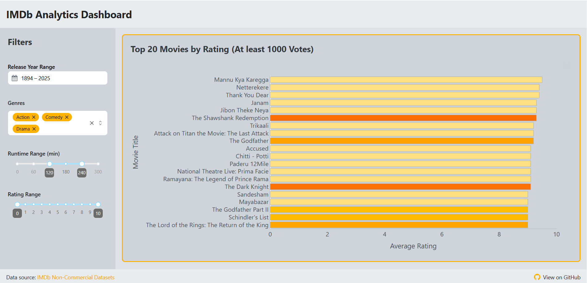

# IMDb Analytics App

IMDb Analytics App is an interactive web dashboard for exploring and analyzing IMDb movie data. Discover insights on movie ratings, genres, runtimes, and trends over the years through dynamic visualizations and filters. Data is fetched from the BigQuery dataset prepared using the [IMDBMoviesETL](https://github.com/Alfredomg7/IMDBMoviesETL) data pipeline.

## Preview

## Features

- **Advanced filters:** Filter by release year, genres, runtime, and rating.
- **Top movies:** View the highest-rated movies according to your criteria.
- **Genre trends:** Analyze the popularity and ratings of genres over time.
- **Runtime distribution:** Explore how movie runtimes vary and their relationship with ratings.
- **Yearly trends:** See the evolution in the quantity and quality of movies released each year.
- **Modern interface:** Responsive UI based on Dash Mantine Components and Plotly.
- **Efficient cache:** Optimized queries and visualizations using cache storage.

## Tech Stack
 
- **Programming Language:** Python 3.12+
- **Frontend/Backend:** Plotly Dash
- **CSS Styling:** Dash Mantine Components
- **Data Processing:** Polars
- **Warehouse:** Google BigQuery
- **Cache:** Flask-Caching
- **Containerization:** Docker

## Local Installation

1. **Clone the repository:**
   ```bash
   git clone https://github.com/Alfredomg7/IMDbAnalyticsApp.git
   cd IMDbAnalyticsApp
   ```

2. **Create a virtual environment (optional but recommended):**
   ```bash
   python -m venv venv
   source venv/bin/activate  # On Windows: venv\Scripts\activate
   ```

3. **Install dependencies:**
   ```bash
   pip install -r requirements.txt
   ```

4. **Set up environment variables:**
   - Copy `.env.example` to `.env` and fill in your Google Cloud credentials and BigQuery dataset/table IDs.

5. **Run the application:**
   ```bash
   python main.py
   ```
   Go to [http://localhost:8050](http://localhost:8050) in your browser.

## Docker Installation

1. **Build the image:**
   ```bash
   docker build -t imdb-analytics-app .
   ```

2. **Run the container:**
   ```bash
   docker run -p 8000:8000 --env-file .env imdb-analytics-app
   ```
   Go to [http://localhost:8000](http://localhost:8000).

## Acknowledgments

- [IMDb Datasets](https://developer.imdb.com/non-commercial-datasets/) for the public data.
- [Plotly](https://plotly.com/) and [Dash](https://dash.plotly.com/) for interactive data visualization and smooth web dashboard development.
- [Dash Mantine Components](https://www.dash-mantine-components.com/) for the modern UI.
- [Google Cloud BigQuery](https://cloud.google.com/bigquery) for efficient data storage and querying.
- [Polars](https://www.pola.rs/) for fast and efficient data processing.

---

For questions, open an issue or contact [alfredomg4000@gmail.com](mailto:alfredomg4000@gmail.com).
